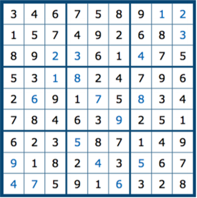
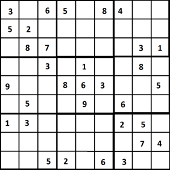
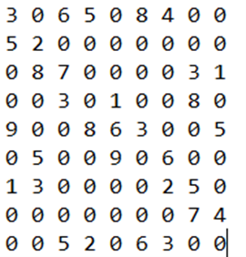

# Sudoku_Solver
Mini Project

## 1. Introduction
Sudoku is a logic-based number-placement puzzle. The standard Sudoku puzzle consists of a 9x9 numeric grid that is divided into 9 3x3 sub-grids called “blocks”. The objective of the puzzle is to fill in the blank cells in a way such that none of the Sudoku rules is violated. The rules of the standard Sudoku puzzle are as follows:

### Rules of the Standard Sudoku Puzzle:
- Each cell can only contain a number from 1 to 9.
- Each number can occur only once in each 3x3 block, row, and column.
The blanks can be filled in any order as long as none of the rules above is violated. Once all the blank spaces are filled in without violating the rules, the puzzle is said to be solved.

## 2. Implementing an algorithm to solve the standard Sudoku puzzle
### Objective
You are required to implement an algorithm capable of solving any given standard Sudoku puzzle as described above. Your implementation must focus on efficiency, and the time complexity of your solution will be tested (Refer to section 4 below).

### Implementation and Requirements
- Implement the algorithm in Python or C++.
- The algorithm should work for any solvable standard Sudoku puzzle.
- Accept a command-line argument for the input file, e.g., `./sudoku_solver input1.txt`.
- Input files must adhere to specific format rules: 9 lines, 9 numbers per line, and use 0 to denote blank cells.
            
- Save the solution in a text file with "_output" appended to the input file name.
- If there's no solution, write "No Solution" to the output file.

## 3. Large Sudoku Puzzle - Hexadoku
Extend the algorithm to solve Hexadoku puzzles, which are 16x16 grids with 16 4x4 blocks. The integers 1-16 are used to fill cells, while the standard rules apply.

## 4. Efficiency and Time Complexity
Efficiency is essential. Aim to solve 9x9 puzzles in under 4 seconds and 16x16 puzzles in under 10 seconds on average. Consider reducing possibilities for each cell and optimizing the filling order.

Hint: See how you could reduce the number of possibilities for each cell and the order in which you fill in the blank cells.

## 5. Submission Guidelines
Submit source files and a report (maximum 5 pages) with the following sections:
- Introduction
- Background and constraints
- Implementation of the Algorithm
- Optimization techniques
- Challenges faced
- Limitations
- Future Improvements

